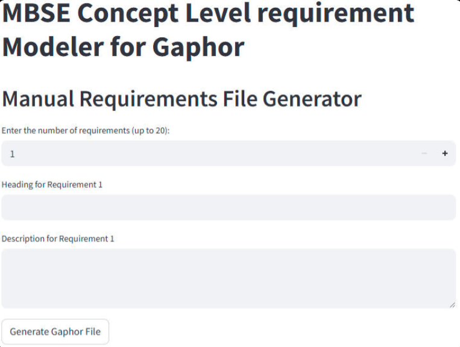
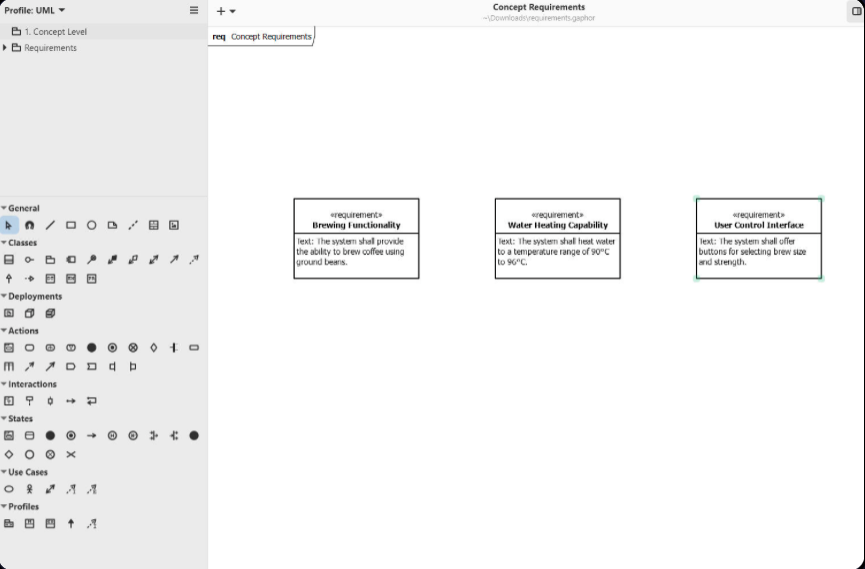

# LLM-Based Automation of MBSE Requirements Modeling (SysML + Gaphor)

A Streamlit web app that helps you create **SysML Requirements** models quickly—from structured input or plain English—and exports a file that can be opened directly in **Gaphor**.

**Live app:** https://llmautomation.streamlit.app/  
**Portfolio write-up:** [MBSE LLM Automation App](https://ranjith-mahesh-en.carrd.co/#llm)  
**University/Collaboration:** Faculty of Informatik and Systems Engineering Department, Otto von Guericke University (OvGU)

## Why this project
Systems engineers (and non-experts) often need requirements diagrams but may not want to spend time learning specialized modeling tools for basic requirements modeling.

This project explores:
- Generating SysML-compatible requirements models without manual diagram drawing.
- Using a LLM to translate plain English requirements into structured SysML requirements elements.
- Supporting ongoing maintenance of requirements models through edit/add/delete workflows.

## What it does (3 modes)
### 1) Manual Mode
- Enter up to **20 requirements** (heading + description).
- Download a ready-to-open Gaphor-compatible requirements model file.

### 2) AI-Based Mode
- Provide requirements in plain English.
- The integrated LLM converts them into a structured requirements model suitable for SysML-style requirements diagrams.

### 3) Modification Mode
- Upload an existing Gaphor requirements model file.
- Perform CRUD operations (add/edit/delete requirements) directly from the UI.
- Download the updated file for continued modeling in Gaphor.

## Quick start (use the hosted app)
1. Open the app: https://llmautomation.streamlit.app/
2. Choose a mode (Manual / AI-Based / Modification).
3. Generate and download the output file.
4. Open it in **Gaphor** to view and continue editing the model.

Download Gaphor: https://gaphor.org/download/

## Example AI prompt
> Create concept level requirements for building a coffee machine, keep a maximum of 5 important requirements.

Output

## Output
- Produces a requirements model file that is intended to be **fully compatible with Gaphor** and directly openable for further SysML/MBSE work.
- Designed to reduce friction between “writing requirements” and “getting a usable model” in downstream MBSE workflows.

## Tech stack
- Python (application + export pipeline)
- Streamlit (interactive web UI, rapid prototyping & deployment)  
- Perplexity API (LLM inference for NL → structured requirements)  
- Prompt engineering & output-constraint design (structured generation for requirements elements)
- Data modeling & transformation (requirements schema, diagram structure, serialization)
- File engineering: Gaphor model file handling (generate/export/import workflows)
- CRUD workflows (edit/add/delete requirements; modification mode)
- Deployment: Streamlit Community Cloud (hosted live demo)

## Notes / limitations
- LLM-generated requirements should be reviewed (especially wording, completeness, and consistency).
- The app focuses on requirements modeling; it does not attempt full system architecture modeling.
- If you hit format/compatibility issues with specific Gaphor versions, please open an issue with the input and generated file attached.
