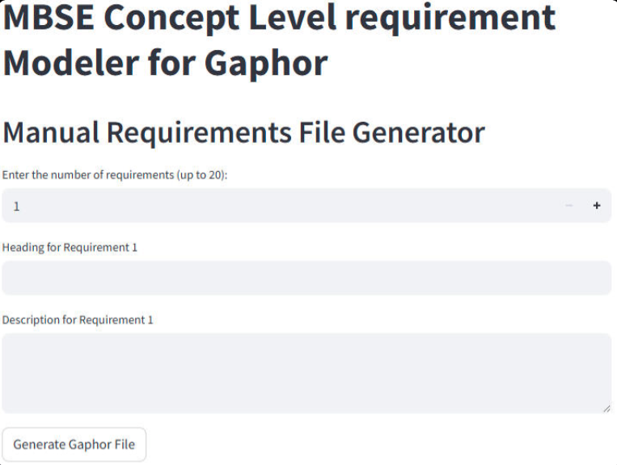
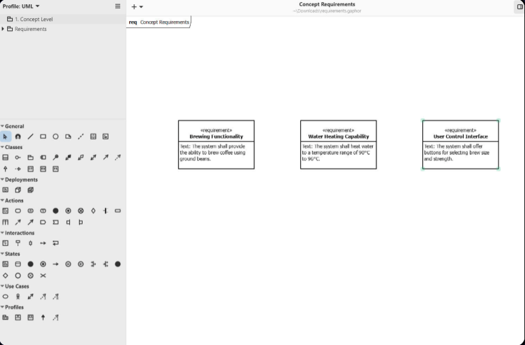

# LLM-Based Automation of MBSE Requirements Modeling (SysML + Gaphor)

A Streamlit web app that uses an **LLM to turn natural-language requirements into structured SysML requirements models**, exported as a file that opens directly in the open-source modeling tool **Gaphor**. It bridges generative AI and model-based systems engineering (MBSE): engineers describe what they need, the app produces a usable model.

**Live app:** [llmautomation.streamlit.app](https://llmautomation.streamlit.app/)  
**Portfolio:** [ranjith-mahesh.netlify.app](https://ranjith-mahesh.netlify.app/#projects)  
**University/Collaboration:** Faculty of Computer Science and Systems Engineering Department, Otto von Guericke University (OvGU)

## Key results

- **Hours to minutes:** requirements model creation drops from hours of manual diagram work to minutes.
- **Graded 1.0** (top grade) at OvGU.
- **End to end:** natural-language input → LLM → structured requirements → Gaphor-compatible model file, deployed as a live web app.

## Why this project
Systems engineers (and non-experts) often need requirements diagrams but may not want to spend time learning specialized modeling tools for basic requirements modeling.

This project explores:
- Using an LLM to translate natural-language requirements into structured SysML requirements elements.
- Generating SysML-compatible requirements models without manual diagram drawing.
- Supporting ongoing maintenance of requirements models through edit/add/delete workflows.

## How it works
1. **Input:** the user describes requirements in natural language, or enters them manually.
2. **Structured generation:** a constrained prompt instructs the LLM (Perplexity API) to return requirements in a fixed structure (heading + description per requirement), with limits such as the maximum number of requirements.
3. **Transformation:** the structured output is mapped to a requirements schema and diagram structure.
4. **Serialization:** the app writes a Gaphor-compatible model file that engineers open and continue editing in Gaphor.

## What it does (3 modes)
### 1) AI-Based Mode
- Provide requirements in natural language (English).
- The integrated LLM converts them into a structured requirements model suitable for SysML-style requirements diagrams.

### 2) Manual Mode
- Enter up to **20 requirements** (heading + description).
- Download a ready-to-open Gaphor-compatible requirements model file.

### 3) Modification Mode
- Upload an existing Gaphor requirements model file.
- Perform CRUD operations (add/edit/delete requirements) directly from the UI.
- Download the updated file for continued modeling in Gaphor.

## Quick start (use the hosted app)
1. Open the app: https://llmautomation.streamlit.app/
2. Choose a mode (AI-Based / Manual / Modification).
3. Generate and download the output file.
4. Open it in **Gaphor** to view and continue editing the model.

Download Gaphor: https://gaphor.org/download/

## Example AI prompt
> Create concept level requirements for building a coffee machine, keep a maximum of 5 important requirements.

Output

## Tech stack
- **LLM & AI:** Perplexity API (LLM inference for natural language → structured requirements), prompt engineering and output-constraint design for structured generation
- **Application:** Python, Streamlit (interactive web UI)
- **Data & files:** requirements schema and diagram structure, serialization to Gaphor model files (generate/export/import)
- **Workflows:** CRUD operations on existing models (Modification Mode)
- **Deployment:** Streamlit Community Cloud (hosted live demo)

## Notes / limitations
- LLM-generated requirements should be reviewed by an engineer (wording, completeness, consistency).
- The app focuses on requirements modeling; it does not attempt full system architecture modeling.
- If you hit format/compatibility issues with specific Gaphor versions, please open an issue with the input and generated file attached.
